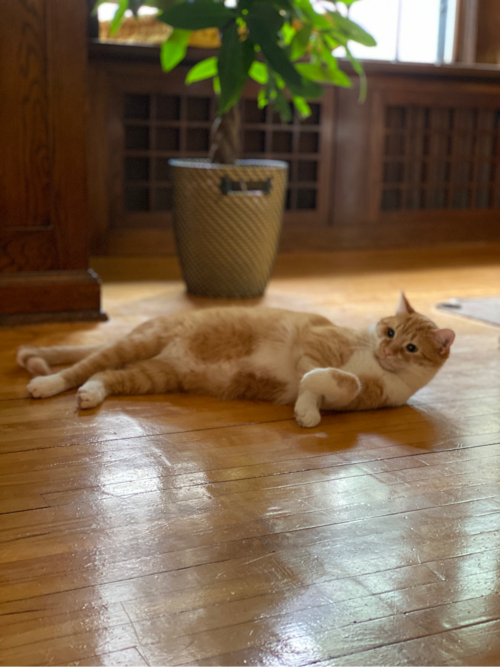

# Hi there 👋

I'm Jon Phenow! I live in my favorite city (Minneapolis, MN) with my wife Steph, our dog Nova, and our cat Gus. When I'm not Software Engineering I play hockey, go to the cabin ([Up North](https://www.youtube.com/watch?v=8OT684hsC7U)), play video games, watching soccer among arguably too many other things.

  

## 🔭 I’m currently working on

I come from App Center @ Microsoft. I recently worked with the GitHub Packages folks for a brief stint and now I'm really excited to be heading over to help with some Core GitHub projects.

## 🌱 I’m currently learning

* More about GitHub
* Relearning some about Go
* Starting some side-projects from scratch with .NET Core
* [Modern Monetary Theory](https://www.amazon.com/Deficit-Myth-Monetary-Peoples-Economy/dp/1541736184)

## 💬 Ask me about

* Minnesota
* Hockey
* Minnesota United F.C. or Tottenham Hotspur F.C.

## 📫 How to reach me

* [Twitter](https://twitter.com/jphenow)
* Just about anything as `jphenow`

## 😄 Pronouns

he/him
